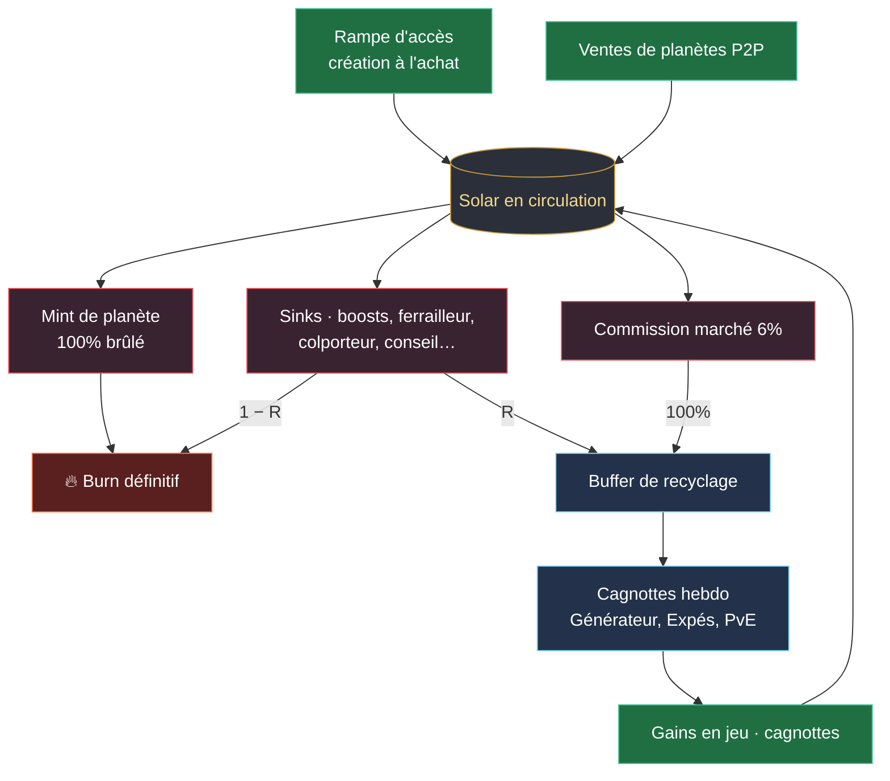

# 6.10. Résumé des Flux Économiques

```mermaid
flowchart TD
    A[Rampe d'accès<br/>création à l'achat]:::in --> C
    P[Ventes de planètes P2P]:::in --> C
    G[Gains en jeu · cagnottes]:::in --> C

    C[(Solar en circulation)]:::circ

    C --> M[Mint de planète<br/>100% brûlé]:::sink
    C --> S[Sinks · boosts, ferrailleur,<br/>colporteur, conseil…]:::sink
    C --> F[Commission marché 6%]:::sink

    M --> BURN[🔥 Burn définitif]:::burn
    S -->|1 − R| BURN
    S -->|R| BUF[Buffer de recyclage]:::treas
    F -->|100%| BUF

    BUF --> CAG[Cagnottes hebdo<br/>Générateur, Expés, PvE]:::treas
    CAG --> G

    classDef in fill:#1f6f43,stroke:#3fbf8f,color:#fff;
    classDef circ fill:#2a2f3a,stroke:#c89b3c,color:#f5d98a;
    classDef sink fill:#3a2330,stroke:#e0555e,color:#fff;
    classDef burn fill:#5a1f1f,stroke:#ff7043,color:#fff;
    classDef treas fill:#23324a,stroke:#7fd8ff,color:#fff;
```
