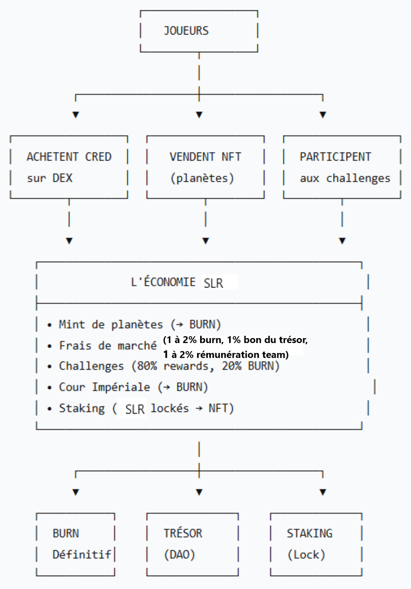

# 6.10. Résumé des Flux Économiques

<figure><figcaption></figcaption></figure>

> La tokenomics est conçue pour être **auto-régulée**, **durable** et **créatrice de valeur** sur le long terme. Les paramètres chiffrés (10M supply, 20$ plancher, taux de staking) sont une base de discussion et pourront être affinés lors des futures itérations.
