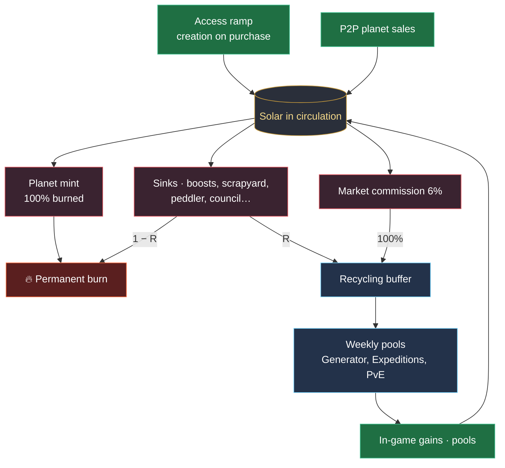

# 6.10. Economic Flow Summary

```mermaid
flowchart TD
    A[Access ramp<br/>creation on purchase]:::in --> C
    P[P2P planet sales]:::in --> C
    G[In-game gains · pools]:::in --> C

    C[(Solar in circulation)]:::circ

    C --> M[Planet mint<br/>100% burned]:::sink
    C --> S[Sinks · boosts, scrapyard,<br/>peddler, council…]:::sink
    C --> F[Market commission 6%]:::sink

    M --> BURN[🔥 Permanent burn]:::burn
    S -->|1 − R| BURN
    S -->|R| BUF[Recycling buffer]:::treas
    F -->|100%| BUF

    BUF --> CAG[Weekly pools<br/>Generator, Expeditions, PvE]:::treas
    CAG --> G

    classDef in fill:#1f6f43,stroke:#3fbf8f,color:#fff;
    classDef circ fill:#2a2f3a,stroke:#c89b3c,color:#f5d98a;
    classDef sink fill:#3a2330,stroke:#e0555e,color:#fff;
    classDef burn fill:#5a1f1f,stroke:#ff7043,color:#fff;
    classDef treas fill:#23324a,stroke:#7fd8ff,color:#fff;
```
